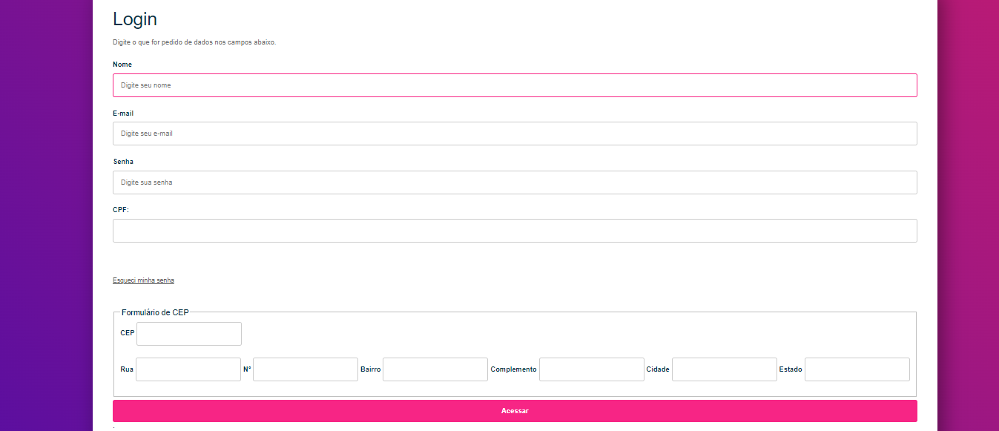
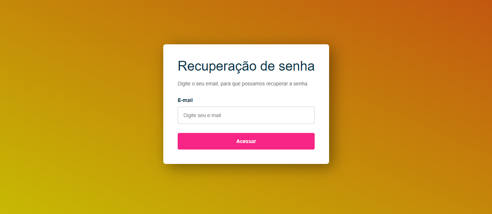
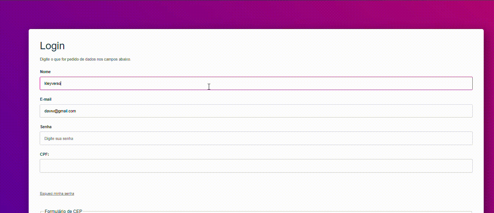

# FormCadastro
# Cadastro de CEP
O projeto tem a função de treinar javaScript, fazendo um site do estilo E-commercer aonde deveria ser validado seu nome, email, senha, Cpf e Cep. Para que assim pudesse proseguir utilizando o site.

# Função
O projeto possui uma interface compreensiva e funcional. No projeto é possível ver diferentes caixas de texto com cada uma tendo sua função. Que no geral servem para que você possa prencheer seus dados de acordo com o que as caixas de texto solicitam. E após preencher, você é levado para uma outra pagina, que estará escrito "O site foi acessado", sendo apenas uma validação que tudo deu certo, já que o projeto não possui realmente um Ecommerce por trás. O site também possui uma função de "Esqueci minha senha", que não funciona da forma correta.

## Fontes
Esse projeto foi feito com o auxilio de outros projetos trabalhos ao longo do ano, sendo eles: 
*https://github.com/KleyversonO/Tela-de-login
*https://github.com/KleyversonO/Form-CadEndereco
*https://github.com/KleyversonO/validacoes

## Tecnologias utilizadas 

* ``HTML 5``
* ``CSS 3``
* ``Java Script``
* ``Github``
* ``VsCode``
* ``Microsoft Teams``
* ``Google``
## Autor
Kleyverson de Oliveira Sampaio